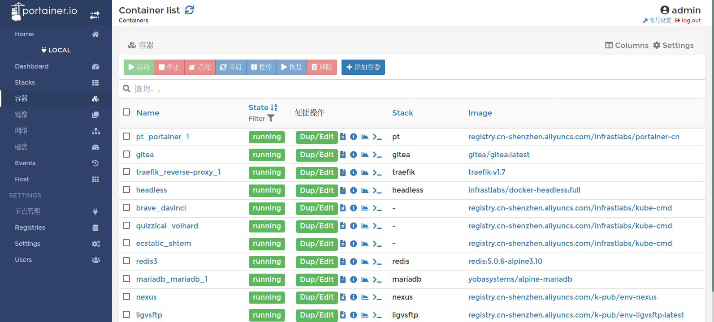
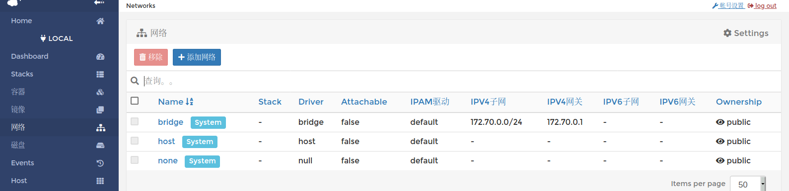
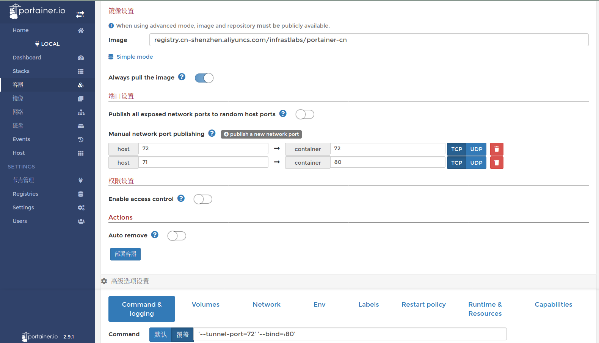

# lang-replacement

- Konga v0.14.9 全支持 (借用 generate/konga.xml)
- Portainer v2.9.1 汉化/定制(docker+porainer两块)



## 快速体验

```bash
# 该镜像基于官方v291做汉化，其它版本请依据汉化步骤自行生成
img=registry.cn-shenzhen.aliyuncs.com/infrastlabs/portainer-cn
docker run -it --rm --net=host -v /var/run/docker.sock:/var/run/docker.sock $img
```

- 汉化/改动项/功能增强
  - 主要版面汉化
  - 通知消息汉化
  - button/表头/placeholder汉化
  - 
  - 菜单：重排序，up/down样式还原
  - 更改通用配置、rdash样式美化
  - 选项框(Access权限)样式美化 (不铺满整页/去除边框，选中未选中大小一致)
  - Hack: 去除官方angularstaticsUI用户行为采集 (仅镜像版)
  - 
  - 前端(Feat)：updateLimits，实时更新容器的CPU/MEM限定
  - 前端(Alter)：屏蔽sidebar/home页新版提示、EE功能页、templates模块(当前用不上它)。
  - 后端(Alter)：调小edgePoll周期：DefaultEdgeAgentCheckinIntervalInSeconds = 1 //5改1秒

**镜像**



**创建/修改容器**



## 定制步骤(Portainer汉化)

欢迎进一步汉化/PR 共同维护字典

step1: **生成字典**  (git比对差异 生成output/portainer_zh.xml，无需定制 请跳下一步)

```bash
# dict生成
# ENV GENERATE_REPO="https://gitee.com/g-devops/fk-portainer" \
#     GENERATE_OUTPUT="portainer_zh.xml" \
#     CMP1="2.9.1" \
#     CMP2="origin/br-lang2"
docker run -it --rm -e CMP1=2.9.1 -e CMP2=origin/br-lang3 -v /mnt/data/$(pwd)/output:/output registry.cn-shenzhen.aliyuncs.com/infrastlabs/lang-replacement:dict


# xml2json
# wget https://hub.fastgit.org/covrom/xml2json/releases/download/1.0/xml2json
cat portainer_zh.xml |./xml2json  |jq

```

step2: **生成汉化包** (生成dict/public.tar.gz或直接构建镜像)

- 默认最新字典：https://gitee.com/g-devops/lang-replacement/raw/dev/output/portainer_zh.xml
- 默认汉化源：https://gitee.com/g-devops/fk-portainer
- 默认分支：TAG="v291-patch"（生成包）， BRANCH="sam-custom"（镜像版）

```bash
# 方式一： 可指定官方/自定义的REPO仓库
# barge: 生成public.tar.gz
# ENV \
#     REPO="https://gitee.com/g-devops/fk-portainer" \ 
#     # BRANCH="release/2.9" \
#     # TAG="2.9.1"
#     TAG="v291-patch" #up/down样式; 美化rdash样式; CPU/MEM限定

# TAG=2.9.1; BRANCH=sam-custom
docker run -it --rm -e TAG=v291-patch -v /mnt/data/$(pwd)/output:/output registry.cn-shenzhen.aliyuncs.com/infrastlabs/lang-replacement:replace

# tar -zxf public.tar.gz 
public=/mnt/data/$(pwd)/output/portainer/dist/public
docker run -it --rm --net=host -v /var/run/docker.sock:/var/run/docker.sock -v $public:/public portainer/portainer-ce:2.9.1-alpine


# 方式二：clone本仓库，直接生成pt镜像`registry.cn-shenzhen.aliyuncs.com/infrastlabs/portainer-cn:latest`
# ENV \
#     REPO="https://gitee.com/g-devops/fk-portainer" \ 
#     BRANCH="sam-custom"
#     # TAG="2.9.1"
sh img_build.sh pt

```


## +templates TODO

- `./templates`已缓存(含图片)，当前调用本地9000端口未登录会被限制使用
- 用法上不需要：只用`psu-stack`自动化部署、PT面板管维

```bash
# https://docs.portainer.io/v/ce-2.9/advanced/app-templates/build

# 地址是对的, 不能用: 需要LOGIN??
# headless @ barge in .../dist/portainer |20:15:24  |tag:v291-patch U:48 ✗| 
$ ./portainer --data=./data --admin-password=$token --templates=http://127.0.0.1:9000/templates/templates.json

```