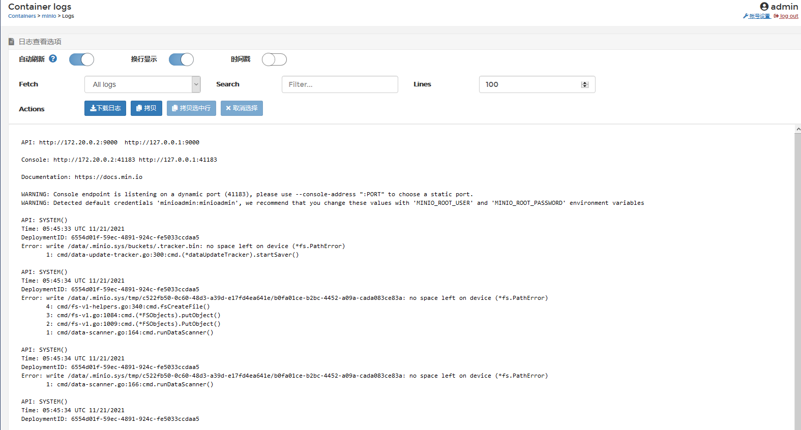

# lang-replacement

反向生成汉化字典，做Portainer 2.x的汉化 (v2.9.1)。PT适当定制，支持多节点管理：由Agent反向连接到管理平台, 详情[fk-agent](https://gitee.com/g-devops/fk-agent)

- Konga v0.14.9 全支持 (借用 generate/konga.xml)
- Portainer v2.9.1 汉化/定制(docker+porainer两块)
- 注：[新推出基于PT做自动部署的解决方案](https://gitee.com/g-devops/fk-portainer-stack-utils)，欢迎关注

[](https://hub.docker.com/r/infrastlabs/portainer-cn/tags)
[](https://hub.docker.com/r/infrastlabs/portainer-cn)
[](https://www.github.com/infrastlabs/lang-replacement)
[](https://www.github.com/infrastlabs/lang-replacement/issues)

**#）节点列表**


**#）容器列表**


## 一、快速体验

```bash
# 该镜像基于官方v291做汉化，其它版本请依据汉化步骤自行生成
docker run -it --rm --net=host -v /var/run/docker.sock:/var/run/docker.sock infrastlabs/portainer-cn
```

**#）日志查看**



## 二、定制步骤(Portainer汉化)

欢迎进一步汉化/PR 共同维护字典

step1: **生成字典**  (git比对差异 生成output/portainer_zh.xml，无需定制 请跳下一步)

```bash
# dict生成
# ENV GENERATE_REPO="https://gitee.com/g-devops/fk-portainer" \
#     GENERATE_OUTPUT="portainer_zh.xml" \
#     CMP1="2.9.1" \
#     CMP2="origin/br-lang2"
docker run -it --rm -e CMP1=2.9.1 -e CMP2=origin/br-lang3 -v /mnt/data/$(pwd)/output:/output registry.cn-shenzhen.aliyuncs.com/infrastlabs/lang-replacement:dict


# xml2json
# wget https://hub.fastgit.org/covrom/xml2json/releases/download/1.0/xml2json
cat portainer_zh.xml |./xml2json  |jq

```

step2: **生成汉化包** (生成dict/public.tar.gz或直接构建镜像)

- 默认最新字典：https://gitee.com/g-devops/lang-replacement/raw/dev/output/portainer_zh.xml
- 默认汉化源：https://gitee.com/g-devops/fk-portainer
- 默认分支：TAG="v291-patch"（生成包）， BRANCH="sam-custom"（镜像版）

```bash
# 方式一： 可指定官方/自定义的REPO仓库
# barge: 生成public.tar.gz
# ENV \
#     REPO="https://gitee.com/g-devops/fk-portainer" \ 
#     # BRANCH="release/2.9" \
#     # TAG="2.9.1"
#     TAG="v291-patch" #up/down样式; 美化rdash样式; CPU/MEM限定

# TAG=2.9.1; BRANCH=sam-custom
docker run -it --rm -e TAG=v291-patch -v /mnt/data/$(pwd)/output:/output registry.cn-shenzhen.aliyuncs.com/infrastlabs/lang-replacement:replace

# tar -zxf public.tar.gz 
public=/mnt/data/$(pwd)/output/portainer/dist/public
docker run -it --rm --net=host -v /var/run/docker.sock:/var/run/docker.sock -v $public:/public portainer/portainer-ce:2.9.1-alpine


# 方式二：clone本仓库，直接生成pt镜像`registry.cn-shenzhen.aliyuncs.com/infrastlabs/portainer-cn:latest`
# ENV \
#     REPO="https://gitee.com/g-devops/fk-portainer" \ 
#     BRANCH="sam-custom"
#     # TAG="2.9.1"
sh img_build.sh pt

```

## 三、Templates模板 TODO

- 1.`./templates`已缓存(含图片)，当前调用本地9000端口未登录会被限制使用
- 2.用法上不需要：只用`psu-stack`自动化部署、PT面板管维
- 3.TODO: pt开放本地特定路径：放开接口认证

```bash
# https://docs.portainer.io/v/ce-2.9/advanced/app-templates/build

# 地址是对的, 不能用: 需要LOGIN??
# headless @ barge in .../dist/portainer |20:15:24  |tag:v291-patch U:48 ✗| 
$ ./portainer --data=./data --admin-password=$token --templates=http://127.0.0.1:9000/templates/templates.json

```

## 四、改动明细、容器化设计

- 主要版面汉化(Docker管理+节点管理)
- Hack: 去除官方angularstaticsUI用户行为采集 (仅镜像版)
- 前端(Feat)：updateLimits，实时更新容器的CPU/MEM限定
- **定制部分(custom):**
- 前端(Alter)：容器日志查看页： 优化顶部排版，以提升日志可视区域
- 后端(Alter)：多用户，节点级别的粗粒度权限管理
- 容器列表：healthy容器底色置蓝，美化UpdateLimit为小锁图标
- Home页列表([多节点](https://gitee.com/g-devops/fk-portainer-stack-utils#4agent%E7%AB%AF---%E8%8A%82%E7%82%B9%E5%88%9D%E5%A7%8B))：edge节点显示cpu/mem, 完整节点URL，快照时间
- Home页刷新([多节点](https://gitee.com/g-devops/fk-portainer-stack-utils#4agent%E7%AB%AF---%E8%8A%82%E7%82%B9%E5%88%9D%E5%A7%8B))：支持EdgeAgent手动刷新快照

**00: 容器化设计**


**01: 汉化/改动项/功能增强**

```markdown
  - **主要版面汉化**(Docker管理+节点管理)
  - 通知消息汉化(全汉化)
  - button(全局)/表头(部分)/placeholder汉化(少量)
  - 
  - 菜单：重排序，up/down样式还原
  - 更改通用配置、rdash样式美化
  - 选项框(Access权限)样式美化 (不铺满整页/去除边框，选中未选中大小一致)
  - Hack: **去除官方angularstaticsUI用户行为采集** (仅镜像版)
  - 
  - 前端(Feat)：**updateLimits，实时更新容器的CPU/MEM限定**
  - 前端(Alter)：屏蔽sidebar/home页新版提示、EE功能页、templates模块(当前用不上它)。
  - 后端(Alter)：调小edgePoll周期：DefaultEdgeAgentCheckinIntervalInSeconds = 1 //5改1秒
  - 前端(Alter)：**容器日志查看页： 优化顶部排版，以提升日志可视区域**
  - 后端(Fix)：修正主页Edge节点心跳检测状态
  - 后端(Feat)：升级chisel v142, 向下兼容，支持Agent以纯UnixSocket模式运行(免TCP端口占用，提升连接性能)
  - 后端(Alter)：**多用户，节点级别的粗粒度权限管理**
```

**02: 使用优化/Custom定制**

```markdown
  - Snap快照优化
    - Home页单击节点，直接进入容器列表(dashboard仪表盘获取全局信息过慢)
    - Home页edge节点显示CPU/MEM, 显示完整ep.URL
    - Home页显示快照时间 snap@2021-11-29 00:00:19 
    - 刷新按钮**支持edgeAgent的snap手动更新**(更新非空闲节点，空闲会触发"待连接"，得连接后下次再刷新生效)
  - Access权限
    - 节点级别的粗粒度权限管理(未设定权限的容器，非管理员用户可管理)
    - Snap刷新操作给到非管理员用户
  - Docker容器管理(Custom)
    - 容器明细：重排序，挂载路径上移、新建镜像置底
    - 容器列表：**healthy容器底色置蓝**(原与running同为绿色)
    - 容器列表：默认不显示Ownership列
    - 容器列表：便捷操作，**美化UpdateLimit为小锁图标**
    - 容器列表：便捷操作，默认不显示Stats/Inspect
    - 容器监控Stats: 进程列表上移、更新周期5>1s
    - 容器信息Inspect：默认显示Json文本
```